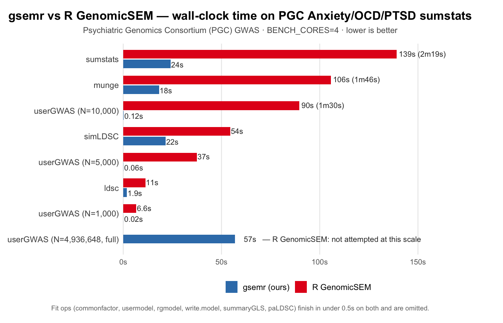

# gsem

[](https://github.com/PoHsuanLai/gsem/actions/workflows/ci.yml)
[](https://crates.io/crates/gsem)
[](https://pypi.org/project/genomicsem/)
[](https://www.rust-lang.org)
[](https://www.gnu.org/licenses/gpl-3.0)

Rust implementation of [GenomicSEM](https://github.com/GenomicSEM/GenomicSEM) — multivariate LD Score Regression and Structural Equation Modeling on GWAS summary statistics.

Available as an **R package** (`gsemr`), **Python package** (`genomicsem`), **Rust crates**, and a **CLI**.

## Performance



Benchmarked end-to-end against [R GenomicSEM](https://github.com/GenomicSEM/GenomicSEM) on the PGC Anxiety, OCD, and PTSD
summary statistics — the same worked example used in the upstream
tutorial. Wall-clock seconds, lower is better:

| Function                         | R GenomicSEM | gsemr (ours) | Speedup |
|----------------------------------|-------------:|-------------:|--------:|
| `munge`                          | 1m 44s       | 21.1s        |      5× |
| `ldsc`                           | 10.5s        | 1.8s         |      6× |
| `sumstats`                       | 2m 16s       | 24.1s        |      6× |
| `simLDSC`                        | 54.3s        | 21.1s        |    2.6× |
| `userGWAS` (N = 1 000)           | 6.3s         | 0.02s        |    373× |
| `userGWAS` (N = 5 000)           | 36.9s        | 0.07s        |    567× |
| `userGWAS` (N = 10 000)          | 1m 30s       | 0.12s        |    748× |
| `userGWAS` (N = 4 936 648, full) | *not attempted* | 57.4s    |       — |

Fit operations (`commonfactor`, `usermodel`, `rgmodel`, `write.model`,
`summaryGLS`, `paLDSC`) finish in well under half a second on both
implementations and are omitted from the headline. See the detailed
breakdown in [`bench/benchmark_plots.pdf`](bench/benchmark_plots.pdf),
and [`ARCHITECTURE.md §2`](./ARCHITECTURE.md#2-why-its-faster) for the
reasons behind the numbers.

Equivalence with R GenomicSEM is verified by the same bench script:
`ldsc`, `commonfactor`, `usermodel`, `rgmodel`, `sumstats`,
`write.model`, `userGWAS`, `paLDSC`, `summaryGLS`, and `simLDSC` all
pass tolerance-based output checks against R on shared inputs. See
[`bench/benchmark_perf.R`](bench/benchmark_perf.R) to reproduce.

## Documentation

- **[`API_COMPAT.md`](./API_COMPAT.md)** — which R GenomicSEM parameters
  are implemented in the Rust port, and which are accepted as stubs.
- **[`ARCHITECTURE.md`](./ARCHITECTURE.md)** — why the Rust port runs
  faster than R GenomicSEM, and where its algorithms and numerical
  outputs diverge from R.
- **[`CONTRIBUTING.md`](./CONTRIBUTING.md)** — dev setup and
  contribution guide.

## Install

### R (gsemr)

Pre-built binary packages are attached to each
[GitHub release](https://github.com/PoHsuanLai/gsem/releases) for
Linux, macOS, and Windows (built against R release). Pick the file
for your platform — **no Rust toolchain needed**:

```r
# Linux (x86_64):
install.packages(
  "https://github.com/PoHsuanLai/gsem/releases/download/v0.1.0/gsemr_0.1.0_linux.tar.gz",
  repos = NULL
)

# macOS:
install.packages(
  "https://github.com/PoHsuanLai/gsem/releases/download/v0.1.0/gsemr_0.1.0.tgz",
  repos = NULL
)

# Windows:
install.packages(
  "https://github.com/PoHsuanLai/gsem/releases/download/v0.1.0/gsemr_0.1.0.zip",
  repos = NULL
)
```

#### From source (requires a Rust toolchain)

Use this if you're on an R version the pre-built binaries don't
match, or for dev builds. You'll need [Rust](https://rustup.rs/)
(MSRV 1.88) on `PATH`.

```r
# Source tarball — fetches internal crates from crates.io:
install.packages(
  "https://github.com/PoHsuanLai/gsem/releases/download/v0.1.0/gsemr_0.1.0.tar.gz",
  repos = NULL, type = "source"
)

# Or straight from GitHub master for dev builds:
remotes::install_github("PoHsuanLai/gsem", subdir = "bindings/r")
```

### Python (genomicsem)

```sh
pip install genomicsem       # pulls pre-built wheels for Linux/macOS/Windows

# From source (requires Rust toolchain):
cd bindings/python && maturin develop --release
```

### CLI

```sh
cargo install gsem           # latest release from crates.io
# Or from source:
cargo install --path crates/gsem
```

### Rust crates

```toml
[dependencies]
gsem-matrix = "0.1"
gsem-ldsc   = "0.1"
gsem-sem    = "0.1"
gsem        = "0.1"   # pipeline + binary
```

## Usage

### R

`gsemr` is a drop-in replacement for GenomicSEM. Same function names, same arguments.

```r
library(gsemr)

# LDSC
covstruc <- ldsc(
  traits = c("trait1.sumstats.gz", "trait2.sumstats.gz", "trait3.sumstats.gz"),
  sample.prev = c(NA, NA, NA),
  population.prev = c(NA, NA, NA),
  ld = "eur_w_ld_chr/",
  wld = "eur_w_ld_chr/",
  trait.names = c("V1", "V2", "V3")
)

# Common factor
cf <- commonfactor(covstruc, estimation = "DWLS")

# User-specified model
um <- usermodel(covstruc, model = "F1 =~ NA*V1 + V2 + V3\nF1 ~~ 1*F1\nV1 ~~ V1\nV2 ~~ V2\nV3 ~~ V3")

# Munge
munge(files = c("gwas1.txt", "gwas2.txt"), hm3 = "w_hm3.snplist", trait.names = c("T1", "T2"))

# Merge sumstats
sumstats(files = c("T1.sumstats.gz", "T2.sumstats.gz"), ref = "eur_w_ld_chr/", trait.names = c("V1", "V2"))

# GWAS
commonfactorGWAS(covstruc, SNPs = "merged_sumstats.tsv")
userGWAS(covstruc, SNPs = "merged_sumstats.tsv", model = "F1 =~ NA*V1 + V2\nF1 ~ SNP")

# Other
paLDSC(covstruc, r = 500)
rgmodel(covstruc)
write.model(loadings_matrix, covstruc$S)
hdl(traits, sample.prev, population.prev, LD.path = "hdl_panels/")
```

All 18 R GenomicSEM functions are implemented:
`ldsc`, `commonfactor`, `usermodel`, `munge`, `sumstats`, `commonfactorGWAS`, `userGWAS`, `paLDSC`, `write.model`, `rgmodel`, `hdl`, `s_ldsc`, `enrich`, `simLDSC`, `multiSNP`, `multiGene`, `summaryGLS`, `convert_hdl_panels`

> **Note on `commonfactorGWAS`:** gsemr's `commonfactorGWAS` matches
> R `GenomicSEM::userGWAS` on the equivalent single-factor model, but
> does **not** numerically match R `GenomicSEM::commonfactorGWAS`, which
> uses a different internal parameterization. On real GWAS data the two
> can disagree in sign and magnitude. See
> [`ARCHITECTURE.md` §3.3](./ARCHITECTURE.md#33-commonfactorgwas-parameterization)
> for the full rationale. If you need bit-for-bit parity with R's
> `commonfactorGWAS`, there is no exact replacement currently; for
> stable single-factor GWAS, use `commonfactorGWAS` or `userGWAS` as
> shown above. A one-time runtime warning is emitted on first use and
> can be suppressed via `options(gsemr.commonfactorGWAS.quiet = TRUE)`
> in R or `GSEMR_COMMONFACTOR_GWAS_QUIET=1` in the environment for
> Python/CLI.

### Python

```python
import genomicsem as gsem

result = gsem.ldsc(
    traits=["trait1.sumstats.gz", "trait2.sumstats.gz"],
    sample_prev=[None, None],
    pop_prev=[None, None],
    ld="eur_w_ld_chr/",
)
result.s      # np.ndarray
result.v      # np.ndarray
result.i_mat  # np.ndarray

cf = gsem.commonfactor(result)
um = gsem.usermodel(result, model="F1 =~ NA*V1 + V2\nF1 ~~ 1*F1")
```

### CLI

```sh
# Munge
gsem munge --files trait1.txt trait2.txt --hm3 w_hm3.snplist --trait-names T1 T2

# LDSC
gsem ldsc --traits T1.sumstats.gz T2.sumstats.gz --ld eur_w_ld_chr/ --out ldsc.json

# SEM
gsem usermodel --covstruc ldsc.json --model "F1 =~ NA*V1 + V2; F1 ~~ 1*F1" --out sem.tsv

# GWAS
gsem userGWAS --covstruc ldsc.json --sumstats merged.tsv --model "F1 =~ NA*V1 + V2; F1 ~ SNP"
```

## Architecture

```
crates/
  gsem-matrix/     nearPD, vech, PSD smoothing
  gsem-ldsc/       LDSC, HDL, stratified LDSC, block jackknife
  gsem-sem/        SEM engine (DWLS/ML, L-BFGS, sandwich SE, fit indices)
  gsem/            CLI, I/O, munge, sumstats merge, GWAS pipeline
bindings/
  r/               R package (gsemr) via extendr
  python/          Python package (genomicsem) via PyO3 + maturin
```

## Development

```sh
cargo build --release
cargo test --workspace      # 117 tests including R validation
cargo bench                 # criterion micro-benchmarks
cd bench && Rscript benchmark_perf.R  # R vs gsemr comparison
```

## Citation

If you use this software, please cite the original GenomicSEM paper:

> GrGrotzinger, A. D., Rhemtulla, M., de Vlaming, R., Ritchie, S. J., Mallard, T. T., Hill, W. D., Ip, H. F., Marioni, R. E., McIntosh, A. M., Deary, I. J., Koellinger, P. D., Harden, K. P., Nivard, M. G., & Tucker-Drob, E. M. (2019). Genomic structural equation modelling provides insights into the multivariate genetic architecture of complex traits. Nature human behaviour, 3(5), 513–525. https://doi.org/10.1038/s41562-019-0566-x

## License

GPL-3.0 — see [LICENSE](LICENSE).
